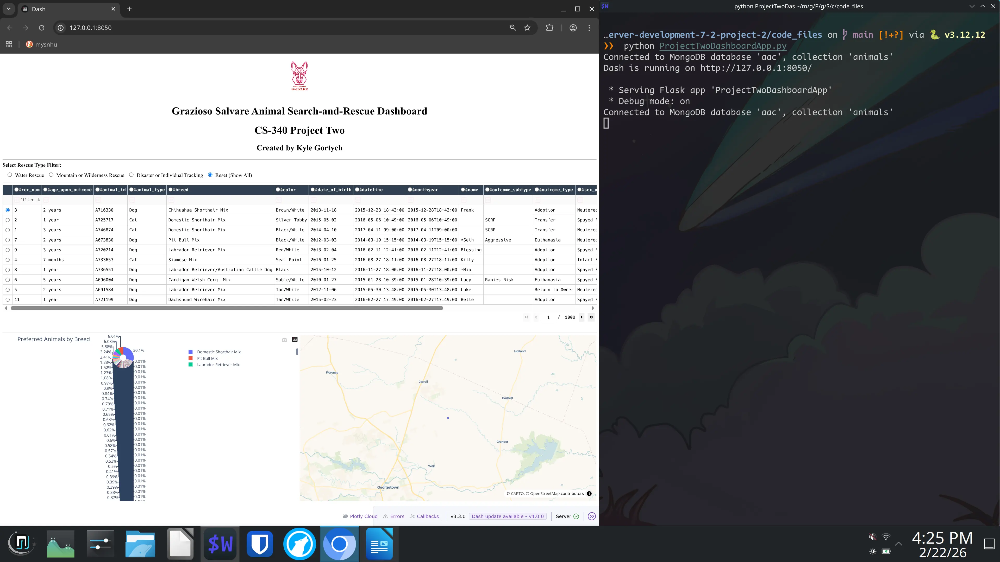
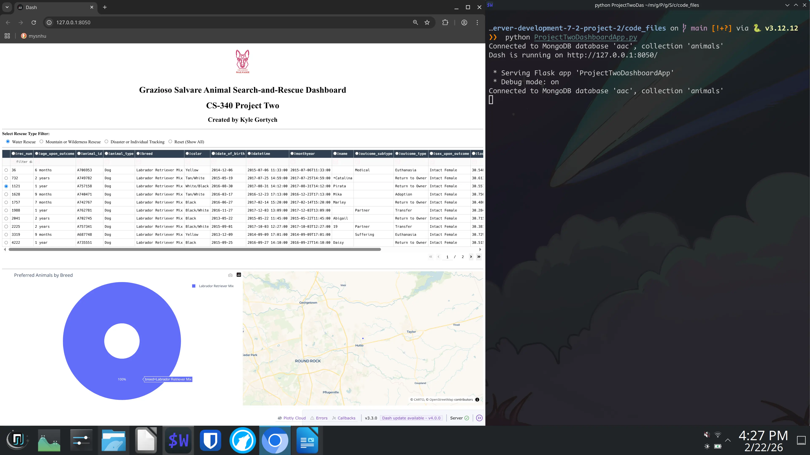
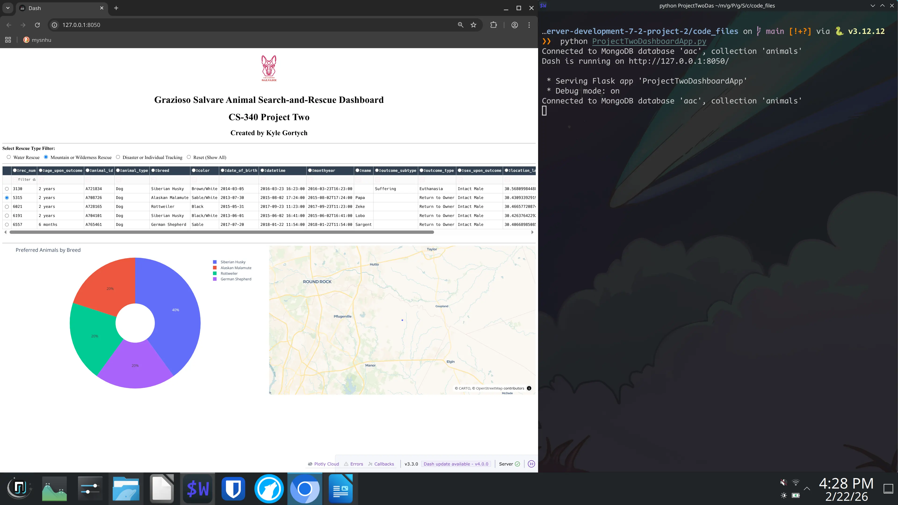
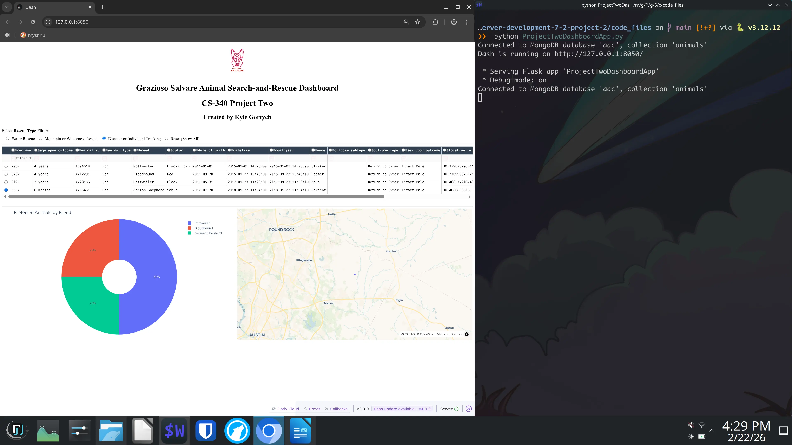

<!-- 
    ____               _           __     ___ 
   / __ \_________    (_)__  _____/ /_   |__ \
  / /_/ / ___/ __ \  / / _ \/ ___/ __/   __/ /
 / ____/ /  / /_/ / / /  __/ /__/ /_    / __/ 
/_/   /_/   \____/_/ /\___/\___/\__/   /____/ 
                /___/                         
 _____     ___ 
/__  /    |__ \
  / /_______/ /
 / /_____/ __/ 
/_/     /____/ 

Date: 2/22/2026
Maintainer: Kyle Gortych
-->

<div align="right">
 


</div>

# Project 2

## About
A full-stack web dashboard for Grazioso Salvare, an international rescue-animal training company. The dashboard allows users to filter and visualize Austin Animal Center shelter data to identify dogs that are good candidates for search-and-rescue training. Built using the MVC design pattern with MongoDB as the model, Dash/Plotly as the view, and a custom CRUD Python module as the controller.

## Motivation
To complete the full-stack development for SNHU CS-340 Client/Server Development Project Two Module 7-2. This project builds on the CRUD module from Project One and the data table from Milestone Six by adding interactive rescue type filtering, a breed distribution pie chart, and a geolocation map.

## Getting Started
Setup is done via `git clone url`.

## Installation

### Tools
Installation best via a system level package manager or ephemeral build environment.
Transitvie dependecies such as language are shown via tree level.

- Python 3.11
    - pymongo
    - bson
    - dash
    - pandas
    - plotly

- MongoDB
    - mongosh

- Git

#### Optional for testing/CI:
- unittest
- unittest.mock

## Usage

### Code Example

#### The CRUD_Python_Module.py file

<details>
<summary>Click to see</summary>

```python
"""
CRUD Python Module for 
"""

from pymongo import MongoClient 
from bson.objectid import ObjectId 

# add for better testing
from pymongo.errors import PyMongoError

import urllib.parse

class CRUD: 
    """ 
    CRUD operations for Animal collection in MongoDB 
    """ 

    def __init__(self, username, password, db_name='aac', host='localhost', port=27017, collection_name='animals'): 
        """
        Initialize MongoDB connection.

        param username: MongoDB username
        param password: MongoDB password
        param db_name: Database name
        param host: MongoDB host
        param port: MongoDB port
        param collection_name: Collection name
        """

        # URL encode username/password for MongoDB URI
        username = urllib.parse.quote_plus(username)
        password = urllib.parse.quote_plus(password)

         
        # Initialize Connection via try excpetion
        try: 
            self.client = MongoClient(
                f'mongodb://{username}:{password}@{host}:{port}/{db_name}?authSource=admin'
            )

            # authentication check
            self.client.admin.command('ping')

            self.database = self.client[db_name] 
            self.collection = self.database[collection_name] 

            print(f"Connected to MongoDB database '{db_name}', collection '{collection_name}'")

        except PyMongoError as e:
            raise Exception(f"Error connecting to MongoDB: {e}")

    def create(self, data):
        """
        Insert a document into the collection.

        param data: dict of key/value pair
        return: True if insert was successful, False otherwise
        """
        if not isinstance(data, dict) or not data: 
            raise ValueError("Data must be a non empty dictionary")

        try:
            self.collection.insert_one(data)
            return True
        except PyMongoError as e:
            print(f"Insert has failed: {e}")
            return False

    def read(self, query):
        """
        Query documents from the collection

        param query: query a dict of key/value pairs to match documents
        return: list of documents matching the query
        """
        if not isinstance(query, dict):
            raise ValueError("Query must be a dict")

        try:
            cursor = self.collection.find(query)
            return list(cursor)
        except PyMongoError as e:
            print(f"Read operation failed: {e}")
            return []

    def update(self, query, new_values):
        """
        Update documents in the collection.

        param query: Dictornary to match documents
        param new_values: Dictornary of update values
        return: Number of ducoments modified
        """
        if not isinstance(query, dict) or not isinstance(new_values, dict):
            raise ValueError("Query and new_values must be dictionaries")
        try:
            result = self.collection.update_many(query, new_values)
            return result.modified_count
        except PyMongoError as error:
            print(f"Update operation failed: {error}")
            return 0

    def delete(self, query):
        """
        Delete document from the collection.

        param query: dictionary to match documents
        retrun: Number of documents deleted
        """
        if not isinstance(query, dict):
            raise ValueError("Query must be a dictionary")

        try:
            result = self.collection.delete_many(query)
            return result.deleted_count
        except PyMongoError as error:
            print(f"Delete operation failed: {error}")
            return 0
```

</details>

#### The ProjectTwoDashboardApp.py file

<details>
<summary>Click to see</summary>

```python
"""
Project Two
CS-340 Client/Server Development (7-2)

Dashboard for Grazioso Salvare to identify dogs suitable for
search-and-rescue training using Austin Animal Center Outcomes data.
Implements MVC pattern with MongoDB model, Dash widgets View,
and CRUD module queries Controller.

Date: 2/22/2026
Maintainer: Kyle Gortych
"""

from dash import Dash, dash_table, html, dcc
from dash.dependencies import Input, Output
import pandas as pd
import os
import base64
import plotly.express as px

from CRUD_Python_Module import CRUD

# Data Manipulation & Model

# MongoDB credentials
username = "aacuser"
password = os.getenv("AAC_PASS")

if not username or not password:
    raise Exception(
        "MongoDB credentials not set. "
        "Please set AAC_PASS environment variable."
    )

# Connect to database via CRUD Module
shelter = CRUD(username, password, db_name='aac', collection_name='animals')

# Retrieve ALL documents (unfiltered starting view)
df = pd.DataFrame.from_records(shelter.read({}))

# Remove MongoDB ObjectId column to prevent DataTable crash
if '_id' in df.columns:
    df.drop(columns=['_id'], inplace=True)

# Dashboard Layout & View

# Initialize Dash app
app = Dash(__name__)

# Encode the Grazioso Salvare logo for inline display
logo_path = os.path.join(os.path.dirname(__file__), 'Grazioso Salvare Logo.png')
if os.path.exists(logo_path):
    encoded_image = base64.b64encode(open(logo_path, 'rb').read()).decode()
    logo_element = html.Img(
        src=f'data:image/png;base64,{encoded_image}',
        style={'height': '100px', 'margin': '10px'}
    )
else:
    logo_element = html.Div("(Logo not found)")

# Dashboard Layout
app.layout = html.Div([

    # Header with logo and unique identifier
    html.Center([
        logo_element,
        html.B(html.H1("Grazioso Salvare Animal Search-and-Rescue Dashboard")),
        html.H1("CS-340 Project Two"),
        html.H2("Created by Kyle Gortych"),
    ]),
    html.Hr(),

    # Interactive filter options with radio buttons for rescue type
    html.Div([
        html.Label("Select Rescue Type Filter:", style={'fontWeight': 'bold', 'fontSize': '16px'}),
        dcc.RadioItems(
            id='filter-type',
            options=[
                {'label': ' Water Rescue', 'value': 'water'},
                {'label': ' Mountain or Wilderness Rescue', 'value': 'mountain'},
                {'label': ' Disaster or Individual Tracking', 'value': 'disaster'},
                {'label': ' Reset (Show All)', 'value': 'reset'},
            ],
            value='reset',
            inline=True,
            style={'margin': '10px 0'},
            inputStyle={'marginRight': '5px', 'marginLeft': '15px'},
        ),
    ]),
    html.Hr(),

    # Interactive data table
    dash_table.DataTable(
        id='datatable-id',
        columns=[
            {"name": i, "id": i, "deletable": False, "selectable": True}
            for i in df.columns
        ],
        data=df.to_dict('records'),
        page_size=10,
        sort_action='native',
        filter_action='native',
        column_selectable='single',
        row_selectable='single',
        selected_rows=[0],
        style_table={'overflowX': 'auto'},
        style_cell={'textAlign': 'left', 'padding': '5px'},
        style_header={
            'backgroundColor': '#2c3e50',
            'color': 'white',
            'fontWeight': 'bold'
        },
    ),

    html.Br(),
    html.Hr(),

    # Charts: pie chart and geolocation map side by side
    html.Div(
        className='row',
        style={'display': 'flex'},
        children=[
            html.Div(
                id='graph-id',
                className='col s12 m6',
                style={'width': '50%'},
            ),
            html.Div(
                id='map-id',
                className='col s12 m6',
                style={'width': '50%'},
            ),
        ]
    ),
])


# Interaction between Components & Controller

def build_rescue_query(filter_type):
    """
    Build a MongoDB query dict based on the selected rescue type.

    Rescue type breed/age/sex criteria from the Grazioso Salvare
    Dashboard Specifications (Preferred Dog Breeds Table).
    """
    if filter_type == 'water':
        return {
            "animal_type": "Dog",
            "breed": {"$in": [
                "Labrador Retriever Mix",
                "Chesapeake Bay Retr Mix",
                "Newfoundland",
            ]},
            "sex_upon_outcome": "Intact Female",
            "age_upon_outcome_in_weeks": {"$gte": 26, "$lte": 156},
        }
    elif filter_type == 'mountain':
        return {
            "animal_type": "Dog",
            "breed": {"$in": [
                "German Shepherd",
                "Alaskan Malamute",
                "Old English Sheepdog",
                "Siberian Husky",
                "Rottweiler",
            ]},
            "sex_upon_outcome": "Intact Male",
            "age_upon_outcome_in_weeks": {"$gte": 26, "$lte": 156},
        }
    elif filter_type == 'disaster':
        return {
            "animal_type": "Dog",
            "breed": {"$in": [
                "Doberman Pinscher",
                "German Shepherd",
                "Golden Retriever",
                "Bloodhound",
                "Rottweiler",
            ]},
            "sex_upon_outcome": "Intact Male",
            "age_upon_outcome_in_weeks": {"$gte": 20, "$lte": 300},
        }
    else:
        # Reset — return all animals
        return {}


@app.callback(
    Output('datatable-id', 'data'),
    [Input('filter-type', 'value')]
)
def update_dashboard(filter_type):
    """Filter the data table based on the selected rescue type."""
    query = build_rescue_query(filter_type)
    filtered = pd.DataFrame.from_records(shelter.read(query))

    if '_id' in filtered.columns:
        filtered.drop(columns=['_id'], inplace=True)

    return filtered.to_dict('records')


@app.callback(
    Output('graph-id', 'children'),
    [Input('datatable-id', 'derived_virtual_data')]
)
def update_graphs(viewData):
    """Display a pie chart of breed distribution from the current data table."""
    if viewData is None or len(viewData) == 0:
        return html.Div("No data available for chart.")

    dff = pd.DataFrame.from_dict(viewData)

    if 'breed' not in dff.columns:
        return html.Div("Breed column not found.")

    fig = px.pie(
        dff,
        names='breed',
        title='Preferred Animals by Breed',
        hole=0.3,
    )
    fig.update_layout(margin={"r": 10, "t": 40, "l": 10, "b": 10})

    return [dcc.Graph(figure=fig)]


@app.callback(
    Output('datatable-id', 'style_data_conditional'),
    [Input('datatable-id', 'selected_columns')]
)
def update_styles(selected_columns):
    """Highlight a selected column in the data table."""
    if not selected_columns:
        return []
    return [
        {'if': {'column_id': i}, 'background_color': '#D2F3FF'}
        for i in selected_columns
    ]


@app.callback(
    Output('map-id', 'children'),
    [
        Input('datatable-id', 'derived_virtual_data'),
        Input('datatable-id', 'derived_virtual_selected_rows'),
    ]
)
def update_map(viewData, selected_rows):
    """Update the geolocation map based on the selected row in the data table."""
    if viewData is None or len(viewData) == 0:
        return html.Div("No data to display on the map.")

    dff = pd.DataFrame(viewData)

    # Default to first row if nothing selected
    row = selected_rows[0] if selected_rows else 0

    # Safely clamp row index
    if row >= len(dff):
        row = 0

    # Use column names by position for compatibility with the dataset
    lat_col = str(dff.columns[13])
    lon_col = str(dff.columns[14])
    breed_col = str(dff.columns[4])
    name_col = str(dff.columns[9])

    # Create Plotly scatter map
    fig = px.scatter_map(
        dff.iloc[[row]],
        lat=lat_col,
        lon=lon_col,
        hover_name=breed_col,
        hover_data={name_col: True},
        zoom=10,
        height=500,
    )
    fig.update_layout(mapbox_style="open-street-map")
    fig.update_layout(margin={"r": 0, "t": 0, "l": 0, "b": 0})

    return dcc.Graph(figure=fig)


# Run server
if __name__ == '__main__':
    app.run(debug=True)
```

</details>

### Tests

#### Unit Tests for ProjectTwoDashboardApp.py

<details>
<summary>Click to see</summary>

```python
"""
Test script for ProjectTwoDashboardApp.py

Maintainer: Kyle Gortych
Date: 02/22/2026
"""

import unittest
from unittest.mock import patch, MagicMock
import pandas as pd


class TestProjectTwoDashboard(unittest.TestCase):
    """Tests for the Project Two Grazioso Salvare Dashboard."""

    @classmethod
    def setUpClass(cls):
        """Mock CRUD and import the app module once for all tests."""
        # Sample record with 15 columns matching the Austin Animal Center dataset
        cls.sample_record = {
            "_id": "abc123",
            "age_upon_outcome": "2 years",
            "animal_id": "A123456",
            "animal_type": "Dog",
            "breed": "Labrador Retriever Mix",
            "color": "Yellow",
            "date_of_birth": "2024-01-01",
            "datetime": "2026-01-15 10:00:00",
            "monthyear": "2026-01-15T10:00:00",
            "name": "Buddy",
            "outcome_subtype": "",
            "outcome_type": "Transfer",
            "sex_upon_outcome": "Intact Female",
            "location_lat": 30.75,
            "location_long": -97.48,
            "age_upon_outcome_in_weeks": 104.0,
        }

        cls.mock_crud_instance = MagicMock()
        cls.mock_crud_instance.read.return_value = [cls.sample_record.copy()]

        # Patch CRUD and os.getenv before importing the app module
        cls.patcher_crud = patch("ProjectTwoDashboardApp.CRUD", return_value=cls.mock_crud_instance)
        cls.patcher_env = patch("ProjectTwoDashboardApp.os.getenv", return_value="dummy_pass")
        cls.patcher_logo = patch("ProjectTwoDashboardApp.os.path.exists", return_value=False)

        cls.patcher_crud.start()
        cls.patcher_env.start()
        cls.patcher_logo.start()

        import ProjectTwoDashboardApp as app_module
        cls.app_module = app_module

    @classmethod
    def tearDownClass(cls):
        cls.patcher_crud.stop()
        cls.patcher_env.stop()
        cls.patcher_logo.stop()

    # DataFrame setup tests 

    def test_dataframe_loads(self):
        """Verify the app creates a valid DataFrame."""
        self.assertIsInstance(self.app_module.df, pd.DataFrame)

    def test_id_column_removed(self):
        """Verify the _id column is removed from the DataFrame."""
        self.assertNotIn("_id", self.app_module.df.columns)

    def test_dataframe_column_count(self):
        """Verify expected column count after _id removal."""
        self.assertEqual(len(self.app_module.df.columns), 15)

    # Query builder tests

    def test_build_query_water_rescue(self):
        """Verify Water Rescue query filters for correct breeds, sex, and age."""
        query = self.app_module.build_rescue_query('water')
        self.assertEqual(query["animal_type"], "Dog")
        self.assertIn("Labrador Retriever Mix", query["breed"]["$in"])
        self.assertIn("Chesapeake Bay Retr Mix", query["breed"]["$in"])
        self.assertIn("Newfoundland", query["breed"]["$in"])
        self.assertEqual(query["sex_upon_outcome"], "Intact Female")
        self.assertEqual(query["age_upon_outcome_in_weeks"]["$gte"], 26)
        self.assertEqual(query["age_upon_outcome_in_weeks"]["$lte"], 156)

    def test_build_query_mountain_rescue(self):
        """Verify Mountain/Wilderness Rescue query filters correctly."""
        query = self.app_module.build_rescue_query('mountain')
        self.assertEqual(query["animal_type"], "Dog")
        self.assertIn("German Shepherd", query["breed"]["$in"])
        self.assertIn("Alaskan Malamute", query["breed"]["$in"])
        self.assertIn("Old English Sheepdog", query["breed"]["$in"])
        self.assertIn("Siberian Husky", query["breed"]["$in"])
        self.assertIn("Rottweiler", query["breed"]["$in"])
        self.assertEqual(query["sex_upon_outcome"], "Intact Male")

    def test_build_query_disaster_rescue(self):
        """Verify Disaster/Individual Tracking query filters correctly."""
        query = self.app_module.build_rescue_query('disaster')
        self.assertEqual(query["animal_type"], "Dog")
        self.assertIn("Doberman Pinscher", query["breed"]["$in"])
        self.assertIn("Golden Retriever", query["breed"]["$in"])
        self.assertIn("Bloodhound", query["breed"]["$in"])
        self.assertEqual(query["sex_upon_outcome"], "Intact Male")
        self.assertEqual(query["age_upon_outcome_in_weeks"]["$gte"], 20)
        self.assertEqual(query["age_upon_outcome_in_weeks"]["$lte"], 300)

    def test_build_query_reset(self):
        """Verify Reset returns an empty query (all records)."""
        query = self.app_module.build_rescue_query('reset')
        self.assertEqual(query, {})

    # Callback Tests

    def test_update_dashboard_calls_crud_read(self):
        """Verify the filter callback queries the database via CRUD."""
        self.mock_crud_instance.read.reset_mock()
        self.mock_crud_instance.read.return_value = [self.sample_record.copy()]

        result = self.app_module.update_dashboard('water')
        self.mock_crud_instance.read.assert_called_once()
        self.assertIsInstance(result, list)

    def test_update_dashboard_reset(self):
        """Verify reset filter returns data."""
        self.mock_crud_instance.read.return_value = [self.sample_record.copy()]
        result = self.app_module.update_dashboard('reset')
        self.assertIsInstance(result, list)
        self.assertGreater(len(result), 0)

    def test_update_graphs_with_data(self):
        """Verify the pie chart callback returns a Graph component."""
        from dash import dcc
        view_data = [
            {"breed": "Labrador Retriever Mix", "name": "Buddy"},
            {"breed": "Labrador Retriever Mix", "name": "Max"},
            {"breed": "Newfoundland", "name": "Bear"},
        ]
        result = self.app_module.update_graphs(view_data)
        self.assertIsInstance(result, list)
        self.assertIsInstance(result[0], dcc.Graph)

    def test_update_graphs_empty_data(self):
        """Verify the pie chart callback handles empty data gracefully."""
        from dash import html
        result = self.app_module.update_graphs([])
        self.assertIsInstance(result, html.Div)

    def test_update_graphs_none_data(self):
        """Verify the pie chart callback handles None data."""
        from dash import html
        result = self.app_module.update_graphs(None)
        self.assertIsInstance(result, html.Div)

    def test_update_map_with_data(self):
        """Verify the map callback returns a Graph for valid data."""
        from dash import dcc
        record = self.sample_record.copy()
        record.pop("_id", None)
        result = self.app_module.update_map([record], [0])
        self.assertIsInstance(result, dcc.Graph)

    def test_update_map_empty_data(self):
        """Verify the map callback handles empty data gracefully."""
        from dash import html
        result = self.app_module.update_map([], None)
        self.assertIsInstance(result, html.Div)

    def test_update_styles_with_selection(self):
        """Verify column highlighting returns style conditionals."""
        result = self.app_module.update_styles(["breed"])
        self.assertEqual(len(result), 1)
        self.assertEqual(result[0]['if']['column_id'], "breed")

    def test_update_styles_no_selection(self):
        """Verify no highlighting when nothing is selected."""
        result = self.app_module.update_styles([])
        self.assertEqual(result, [])


if __name__ == "__main__":
    unittest.main()
```

</details>

### Screenshots showing operation

Shows the dashboard in its starting state and after each rescue type filter is applied.

<details>
<summary>Click to see</summary>

#### Starting State (Reset — All Animals)
<div align="center">
  
</div>

#### Water Rescue Filter
<div align="center">
  
</div>

#### Mountain or Wilderness Rescue Filter
<div align="center">
  
</div>

#### Disaster or Individual Tracking Filter
<div align="center">
  
</div>

</details>

## Questions

### Why MongoDB?
MongoDB was chosen as the model component because it is a document-oriented NoSQL database that stores data in flexible JSON-like (BSON) documents. This makes it a natural fit for interfacing with Python, since documents map directly to Python dictionaries without requiring an ORM or rigid schema. MongoDB's query language supports complex filtering with operators like `$in`, `$gte`, and `$lte`, which made it straightforward to implement the rescue-type breed/age/sex queries required by Grazioso Salvare. Its scalability and indexing capabilities also allow for efficient retrieval even as the shelter dataset grows.

### Why Dash?
The Dash framework by Plotly was used to provide both the view and controller layers of the MVC architecture. Dash allows building interactive web applications entirely in Python, which keeps the entire stack in one language. Its callback system acts as the controller, linking user interactions (like selecting a radio button) to data updates and widget re-renders. Dash components such as `DataTable`, `dcc.Graph`, and `dcc.RadioItems` provided the interactive widgets needed for the data table, pie chart, and geolocation map without requiring any front-end JavaScript.

## Resources
- [Dash Documentation](https://dash.plotly.com/)
- [Plotly Express](https://plotly.com/python/plotly-express/)
- [PyMongo Documentation](https://pymongo.readthedocs.io/)
- [MongoDB Manual](https://www.mongodb.com/docs/manual/)
- [Austin Animal Center Data](https://data.austintexas.gov/)
